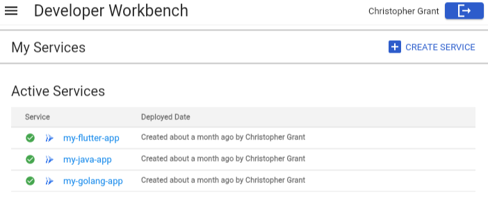
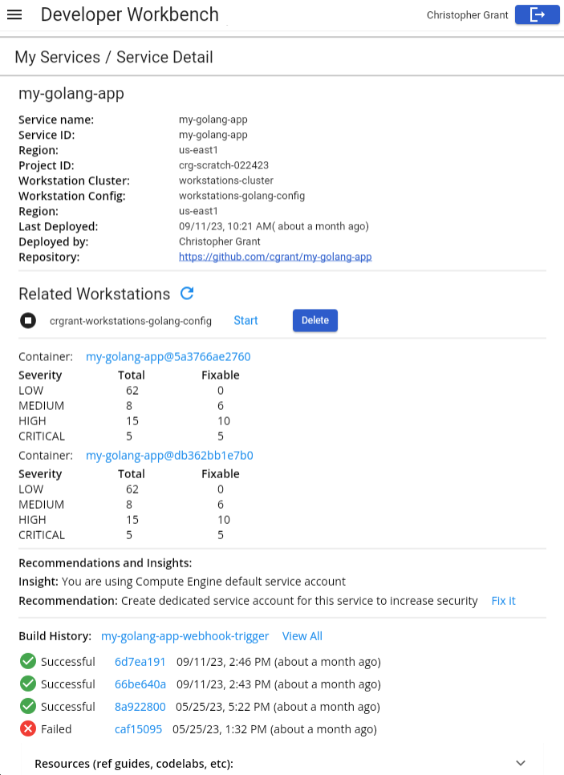

# Cloud Developer Workbench

A portal for creating new applications and infrastructure quickly and with minimal effort that conform to industry best practices and internal organizational policies.

The application highlights and demonstrates

- Developer interface for onboarding new applications
- Day 2 operations for app dev teams
- Self serve provisioning of related infrastructure
- Click to install full example architecture solutions
- Custom private templates for internal golden path technology stacks

## Project Objective

This effort was initiated to highlight patterns and practices organizations can implement to streamline their Cloud Dev & Delivery efforts. Key discussion points focus on the use of application templates for streamlining onboarding, dashboards for efficient access, integrating with Google Cloud APIs for custom integrations and more.

Additionally the stack is built with Dart and Flutter to highlight robust capabilities of the framework. Companies looking to modernize are adopting Flutter so teams and developers can deliver apps across mobile, web and desktop with one language. This application demonstrates some of that capability and highlights how organizations might utilize flutter for their own robust use cases.

## Not an officially supported Google product

This repository demonstrates patterns and practices used by Cloud Platform Engineers, Cloud Developers and other Cloud Practitioners. This is not an official Google product.  This is prototype code intended for demonstration and discussion, it is not intended for direct production use. The software is provided as is with best effort support.
